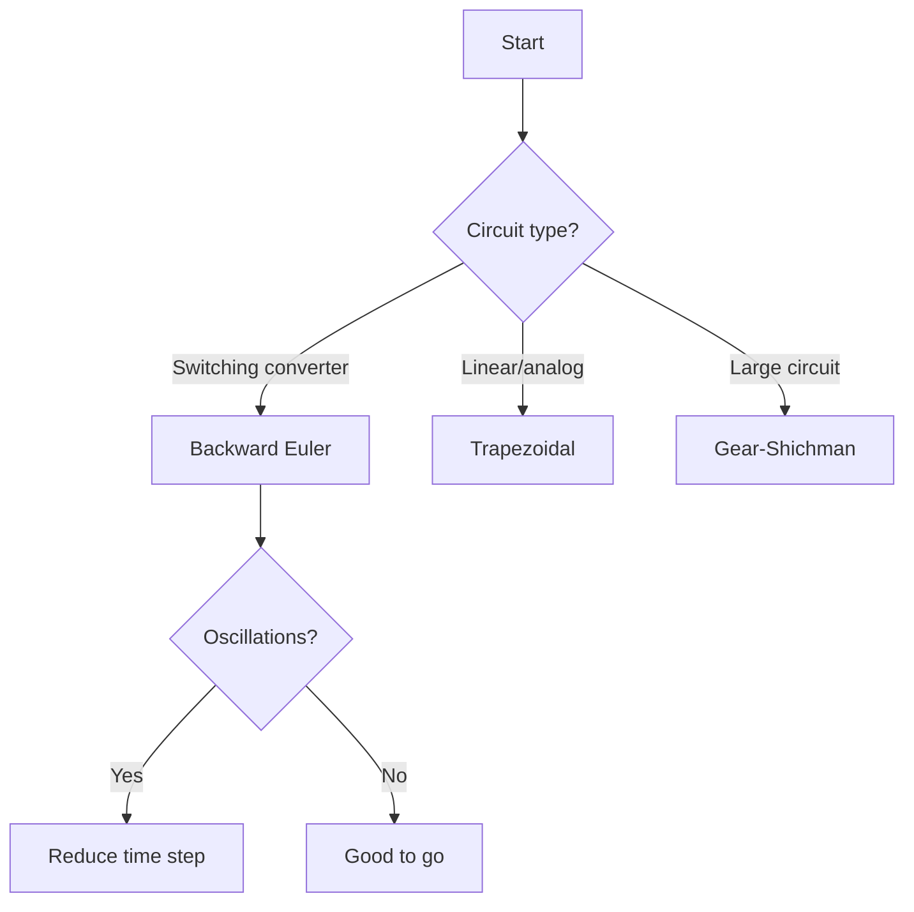

# Running Simulations

How to configure and run simulations in GeckoCIRCUITS.

**Duration:** 10 minutes

**Prerequisites:** [Building Circuits](building-circuits.md)

## Simulation Settings

Access via **Simulation > Settings** or the toolbar gear icon.

### Essential Parameters

| Parameter | Description | How to Choose |
|-----------|-------------|---------------|
| **Total time (T_end)** | Simulation duration | 10-100x switching period |
| **Time step (dt)** | Computation interval | < T_sw / 100 |
| **Solver** | Numerical method | See solver table below |

### Time Step Selection

The time step is the most critical setting. Too large causes errors; too small wastes computation time.

**Rule of thumb:** dt < 1/(100 x f_sw)

| Switching Freq | Max Time Step | Recommended |
|---------------|---------------|-------------|
| 10 kHz | 1 us | 500 ns |
| 50 kHz | 200 ns | 100 ns |
| 100 kHz | 100 ns | 50 ns |
| 500 kHz | 20 ns | 10 ns |

### Simulation Duration

Choose enough time for the circuit to reach steady state:

- **Fast circuits** (> 100 kHz): 0.1 - 1 ms
- **Medium circuits** (10-100 kHz): 1 - 10 ms
- **Slow circuits** (< 10 kHz, motors): 10 - 100 ms
- **Thermal transients**: 1 - 100 s

## Solvers

GeckoCIRCUITS offers three fixed-step solvers:

| Solver | Accuracy | Stability | Best For |
|--------|----------|-----------|----------|
| **Backward Euler (BE)** | 1st order | Very stable | Default choice, stiff circuits |
| **Trapezoidal (TRZ)** | 2nd order | Can oscillate | Accuracy-critical circuits |
| **Gear-Shichman (GS)** | Multi-step | Stable | Large circuits |

### Which Solver to Use?



!!! tip "Start with Backward Euler"
    When in doubt, use Backward Euler. It's the most stable and works well for most power electronics circuits. Switch to Trapezoidal only if you need higher accuracy for resonant or filter circuits.

## Running a Simulation

### Interactive Mode

1. Press ++f5++ or click **Run**
2. Watch the progress bar
3. Results appear in SCOPE windows when complete
4. Press **Stop** to abort

### Batch Mode

For automated runs (MATLAB, Python, GeckoSCRIPT):

```bash
java -jar gecko.jar --batch circuit.ipes
```

This runs the simulation without GUI and exits when complete.

## Simulation Performance

### Computation Time

Approximate formula:

```
compute_time ~ (T_end / dt) × N_components × solver_cost
```

| Factor | Impact |
|--------|--------|
| Halving dt | 2x slower |
| Doubling T_end | 2x slower |
| Doubling components | ~2-4x slower |

### Speeding Up Simulations

1. **Increase time step** - As large as accuracy allows
2. **Reduce simulation time** - Only simulate what you need
3. **Simplify circuit** - Remove unused components
4. **Close scope windows** - Real-time plotting costs CPU
5. **Increase heap** - `java -Xmx4G` for large circuits

## Initial Conditions

By default, all voltages and currents start at zero. This means the circuit needs time to reach steady state.

### Skipping Startup Transients

Options:

1. **Run longer** - Simply simulate enough cycles for settling
2. **Set initial conditions** - Pre-set capacitor voltages and inductor currents
3. **Use GeckoSCRIPT** - Programmatically set initial state

## Convergence Issues

If the simulation fails to converge:

| Symptom | Cause | Solution |
|---------|-------|----------|
| NaN values | Numerical overflow | Reduce time step |
| Oscillating output | Trapezoidal ringing | Switch to Backward Euler |
| Very slow | Time step too small | Increase dt if accuracy allows |
| Wrong results | Time step too large | Decrease dt |

## Next Steps

- [Analysis Tools](analysis-tools.md) - Measuring and exporting results
- [GeckoSCRIPT](../tutorials/scripting/geckoscript.md) - Automate simulation runs
- [Tutorials](../tutorials/index.md) - Application-specific simulations
