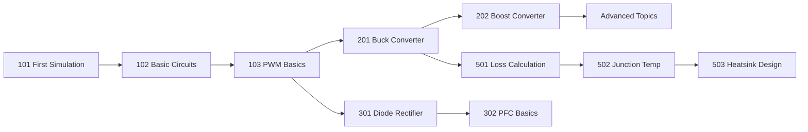

# GeckoCIRCUITS

<div class="grid cards" markdown>

-   :material-lightning-bolt:{ .lg .middle } **Power Electronics Simulation**

    ---

    Simulate DC-DC, AC-DC, DC-AC converters with multi-domain support for electrical, thermal, and EMI analysis.

    [:octicons-arrow-right-24: Getting Started](getting-started/index.md)

-   :material-school:{ .lg .middle } **50+ Tutorials**

    ---

    Step-by-step guides from basic circuits to advanced control systems, motor drives, and HVDC applications.

    [:octicons-arrow-right-24: Tutorials](tutorials/index.md)

-   :material-file-document-multiple:{ .lg .middle } **100+ Examples**

    ---

    Ready-to-run circuit files covering automotive, renewable energy, and industrial applications.

    [:octicons-arrow-right-24: Examples](examples/index.md)

-   :material-code-braces:{ .lg .middle } **Automation & Integration**

    ---

    Control simulations from MATLAB, Python, or via REST API for automated testing and optimization.

    [:octicons-arrow-right-24: API Reference](api/index.md)

</div>

## What is GeckoCIRCUITS?

GeckoCIRCUITS is an open-source circuit simulator specialized for power electronics. It provides:

- **Multi-domain simulation** - Electrical, thermal, magnetic, and mechanical
- **Real-time visualization** - Oscilloscope with live waveforms
- **MATLAB/Simulink integration** - Co-simulation and parameter sweeps
- **Extensive component library** - Switches, diodes, transformers, motors
- **Advanced analysis** - Thermal modeling, loss calculation, EMI prediction

## Quick Example

```
┌─────────────────────────────────────────┐
│          Buck Converter                  │
│                                          │
│   Vin ──┬──[S]──┬──[L]──┬── Vout        │
│         │       │       │               │
│         │      [D]     [C]    [R]       │
│         │       │       │     │         │
│   GND ──┴───────┴───────┴─────┴── GND   │
│                                          │
│   Vout = D × Vin                        │
└─────────────────────────────────────────┘
```

## Getting Started

=== "Linux"

    ```bash
    # Clone and build
    git clone https://github.com/geckocircuits/geckocircuits.git
    cd geckocircuits
    mvn clean package assembly:single -DskipTests

    # Run
    ./scripts/run-gecko-linux.sh
    ```

=== "Windows"

    ```batch
    :: Clone and build
    git clone https://github.com/geckocircuits/geckocircuits.git
    cd geckocircuits
    mvn clean package assembly:single -DskipTests

    :: Run
    scripts\run-gecko.bat
    ```

=== "macOS"

    ```bash
    # Clone and build
    git clone https://github.com/geckocircuits/geckocircuits.git
    cd geckocircuits
    mvn clean package assembly:single -DskipTests

    # Run
    ./scripts/run-gecko-macos.sh
    ```

## Tutorial Roadmap



## Featured Examples

| Example | Description | Difficulty |
|---------|-------------|------------|
| [Buck Converter](examples/basic/buck.md) | Step-down DC-DC with PWM control | Beginner |
| [Boost PFC](tutorials/acdc/pfc-basics.md) | Power factor correction | Intermediate |
| [PMSM FOC](examples/motor-drives/pmsm-foc.md) | Field-oriented motor control | Advanced |
| [EV Charger](examples/automotive/ev-charger.md) | Level 2 AC charging | Intermediate |
| [MMC Converter](tutorials/dcac/mmc-converter.md) | Modular multilevel for HVDC | Advanced |

## Comparison with Other Tools

| Feature | GeckoCIRCUITS | PLECS | PSIM | SIMBA | LTspice | QSPICE |
|---------|---------------|-------|------|-------|---------|--------|
| **Licensing** | Open Source | Commercial | Commercial | Commercial | Freeware | Freeware |
| Power Electronics Focus | ✅ | ✅ | ✅ | ✅ | ⚠️ General | ✅ |
| Ideal Switch Models | ✅ | ✅ | ✅ | ✅ | ❌ | ❌ |
| Thermal Simulation | ✅ Built-in | ✅ Built-in | ✅ Add-on | ✅ Built-in | ⚠️ Manual | ⚠️ SPICE |
| Magnetic Domain | ✅ | ✅ | ✅ | ✅ | ❌ | ❌ |
| Mechanical Domain | ✅ | ✅ | ✅ | ✅ | ⚠️ Manual | ⚠️ Manual |
| Motor Models (PMSM/BLDC/IM) | ✅ | ✅ | ✅ Add-on | ✅ | ⚠️ Manual | ⚠️ Manual |
| MATLAB/Simulink Integration | ✅ RMI | ✅ Blockset | ✅ Co-sim | ❌ | ❌ | ❌ |
| Python Scripting | ✅ | ✅ XML-RPC | ✅ API | ✅ Native | ❌ | ✅ |
| C/C++ Custom Blocks | ✅ Java | ✅ C-Script | ✅ C-block | ✅ C-code | ❌ | ✅ C++/Verilog |
| Code Generation | ❌ | ✅ Coder | ✅ | ❌ | ❌ | ❌ |
| REST API | ✅ | ❌ | ❌ | ❌ | ❌ | ❌ |
| Cloud/Online Version | ❌ | ❌ | ❌ | ✅ | ❌ | ❌ |
| Analysis Tools (Bode, SS) | ✅ | ✅ | ✅ | ✅ AC Sweep | ⚠️ AC | ⚠️ AC |
| EMI/Conducted EMC | ✅ | ⚠️ Limited | ✅ | ⚠️ | ✅ | ✅ |
| SiC/GaN Device Models | ✅ | ✅ | ✅ | ✅ | ⚠️ | ✅ Native |
| PSIM Import | ❌ | ❌ | N/A | ✅ | ❌ | ❌ |

**Legend:** ✅ = Full support | ⚠️ = Partial/Manual | ❌ = Not available

### Tool Characteristics

| Tool | Best For | Website |
|------|----------|---------|
| **GeckoCIRCUITS** | Power electronics education, MATLAB integration, open-source | [GitHub](https://github.com/geckocircuits/geckocircuits) |
| **PLECS** | Professional power electronics, Simulink co-sim, code generation | [plexim.com](https://www.plexim.com) |
| **PSIM** | Motor drives, SmartCtrl design, embedded code | [altair.com/psim](https://altair.com/psim) |
| **SIMBA** | Modern UI, Python-first workflow, cloud simulation | [simba.io](https://www.simba.io) |
| **LTspice** | Analog circuits, component-level SPICE | [analog.com](https://www.analog.com/ltspice) |
| **QSPICE** | Mixed-signal, SiC/GaN power devices, fast simulation | [qorvo.com](https://www.qorvo.com/design-hub/design-tools/interactive/qspice) |

## Community

- :fontawesome-brands-github: [GitHub Repository](https://github.com/geckocircuits/geckocircuits)
- :material-bug: [Issue Tracker](https://github.com/geckocircuits/geckocircuits/issues)
- :material-forum: [Discussions](https://github.com/geckocircuits/geckocircuits/discussions)

## Citation

If you use GeckoCIRCUITS in your research, please cite:

```bibtex
@software{geckocircuits,
  title = {GeckoCIRCUITS: Power Electronics Circuit Simulator},
  author = {GeckoCIRCUITS Team},
  year = {2024},
  url = {https://github.com/geckocircuits/geckocircuits}
}
```

---

<div class="grid cards" markdown>

-   :material-download:{ .lg .middle } **Download**

    Get the latest release

    [:octicons-arrow-right-24: Download](resources/download.md)

-   :material-book-open-variant:{ .lg .middle } **Documentation**

    Complete user guide

    [:octicons-arrow-right-24: Docs](getting-started/index.md)

-   :material-help-circle:{ .lg .middle } **Support**

    FAQ and troubleshooting

    [:octicons-arrow-right-24: Help](resources/faq.md)

</div>
