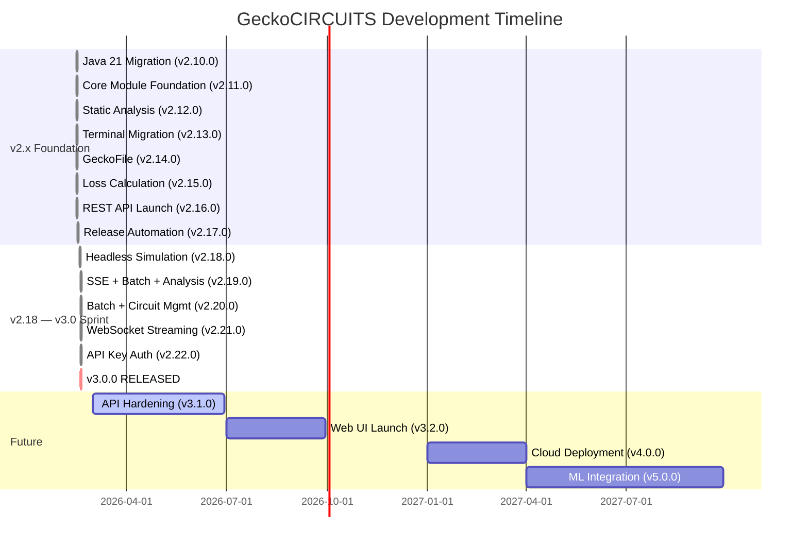

# GeckoCIRCUITS Roadmap & Release Plan

Strategic roadmap for GeckoCIRCUITS development — completed milestones, future plans, and release process.

**Last Updated:** 2026-02-22

---

## Current Status

- **Latest Release:** v3.0.0 — Complete REST API Platform (Feb 18, 2026)
- **Ground Zero:** v2.10.0 — Java 21 Migration (Feb 14, 2026)
- **Total Releases:** 13 versions (v2.10.0 → v3.0.0)
- **Tests:** 7,434 total (5,373 main + 1,837 core + 224 API)
- **Core Module:** 216 classes, 80 test files
- **REST API:** 32 endpoints, Spring Boot 3.2.1, Docker-ready

---

## Timeline Visualization

---

## Completed Releases

### v3.0.0 — Complete REST API Platform (Feb 18, 2026)

**MILESTONE: 32 endpoints, 7,434 tests, production-ready**

- 32 REST API endpoints (loss calc, circuits, simulation, batch, analysis, WebSocket)
- Spring Security API key authentication
- WebSocket/STOMP real-time streaming
- Batch simulation (linearSweep/logSweep/explicit)
- Signal analysis (characteristics, Fourier/FFT)
- Real MNA solver backend in headless engine
- See [v3.0.0 release notes](releases/3000.md)

### v2.18.0 — v2.22.0 Sprint (Feb 17-18, 2026)

| Version | Milestone | Key Deliverables |
|---------|-----------|-----------------|
| v2.22.0 | API Key Auth | Spring Security, X-API-Key header, 20 security tests |
| v2.21.0 | WebSocket | STOMP/SockJS real-time simulation progress |
| v2.20.0 | Batch + Circuit Mgmt | Batch status/cancel, circuit clone/parameter update |
| v2.19.0 | SSE + Batch + Analysis | SSE streaming, batch simulations, signal analysis |
| v2.18.0 | Headless Engine | Real MNA solver, domain coupling, simulation control |

### v2.10.0 — v2.17.0 Foundation (Feb 12-15, 2026)

| Version | Milestone | Release Notes |
|---------|-----------|---------------|
| [v2.17.0](releases/2170.md) | Release Automation | GitHub Actions, 5 platform builds |
| [v2.16.0](releases/2160.md) | REST API Launch | First 8 endpoints, Docker packaging |
| [v2.15.0](releases/2150.md) | Loss Calculation | UserParameter abstraction, loss curves |
| [v2.14.0](releases/2140.md) | GeckoFile Migration | Circuit file I/O headlessly |
| [v2.13.0](releases/2130.md) | Terminal/Component | Circuit parsing, TokenMap migration |
| [v2.12.0](releases/2120.md) | Static Analysis | PMD 3,443 → 496 (-86%), SpotBugs 0 |
| [v2.11.0](releases/2110.md) | Core Module | gecko-simulation-core, math/datacontainer |
| [v2.10.0](releases/2100.md) | Java 21 (GROUND ZERO) | Java 21 upgrade, deprecated API fixes |

### Pre-Fork

| Version | Source | Description |
|---------|--------|-------------|
| v2.04-repo-reorg | tinix84 fork | Repository reorganization, JDK 21 workflow |
| v2.03-spotbugs-clean | tinix84 fork | All 1,096 SpotBugs violations fixed |
| v2.02 | geckocircuits/GeckoCIRCUITS | Last upstream release |

---

## Future Releases

### v3.1.0 — API Hardening & Security (Q2 2026)

**Epic:** [#17](https://github.com/geckocircuits/GeckoCIRCUITS/issues/17) | **Milestone:** [v3.1.0](https://github.com/geckocircuits/GeckoCIRCUITS/milestone/1)

| Issue | Feature | Status |
|-------|---------|--------|
| [#24](https://github.com/geckocircuits/GeckoCIRCUITS/issues/24) | Rate limiting and request throttling | Planned |
| [#25](https://github.com/geckocircuits/GeckoCIRCUITS/issues/25) | JWT token authentication | Planned |
| [#26](https://github.com/geckocircuits/GeckoCIRCUITS/issues/26) | Pagination for list endpoints | Planned |
| [#27](https://github.com/geckocircuits/GeckoCIRCUITS/issues/27) | WebSocket authentication | Planned |
| [#28](https://github.com/geckocircuits/GeckoCIRCUITS/issues/28) | Enhanced circuit parsing | Planned |
| [#29](https://github.com/geckocircuits/GeckoCIRCUITS/issues/29) | RBAC (Role-Based Access Control) | Planned |
| [#30](https://github.com/geckocircuits/GeckoCIRCUITS/issues/30) | Client SDKs (Python, Java, JS) | Planned |

---

### v3.2.0 — Web UI Launch (Q3 2026)

**Epic:** [#18](https://github.com/geckocircuits/GeckoCIRCUITS/issues/18) | **Milestone:** [v3.2.0](https://github.com/geckocircuits/GeckoCIRCUITS/milestone/2)

| Issue | Feature | Status |
|-------|---------|--------|
| [#31](https://github.com/geckocircuits/GeckoCIRCUITS/issues/31) | React + TypeScript application scaffold | Planned |
| [#32](https://github.com/geckocircuits/GeckoCIRCUITS/issues/32) | Circuit editor with drag-and-drop | Planned |
| [#33](https://github.com/geckocircuits/GeckoCIRCUITS/issues/33) | Real-time oscilloscope visualization | Planned |
| [#34](https://github.com/geckocircuits/GeckoCIRCUITS/issues/34) | PWA support for offline use | Planned |

**Technologies:** React 18, TypeScript, MUI, D3.js/WebGL, WebSocket/STOMP, Redux/Zustand

---

### v4.0.0 — Cloud Deployment (Q1 2027)

**Epic:** [#19](https://github.com/geckocircuits/GeckoCIRCUITS/issues/19) | **Milestone:** [v4.0.0](https://github.com/geckocircuits/GeckoCIRCUITS/milestone/3)

| Issue | Feature | Status |
|-------|---------|--------|
| [#35](https://github.com/geckocircuits/GeckoCIRCUITS/issues/35) | Kubernetes orchestration (Helm charts) | Planned |
| [#36](https://github.com/geckocircuits/GeckoCIRCUITS/issues/36) | Multi-tenant isolation + workspaces | Planned |
| [#37](https://github.com/geckocircuits/GeckoCIRCUITS/issues/37) | Redis caching + PostgreSQL metadata | Planned |
| [#38](https://github.com/geckocircuits/GeckoCIRCUITS/issues/38) | Prometheus metrics + Grafana dashboards | Planned |

**Infrastructure:** Kubernetes (EKS/AKS/GKE), Terraform/Pulumi, ArgoCD, Grafana + Prometheus

---

### v5.0.0 — Machine Learning Integration (Q3 2027)

**Epic:** [#20](https://github.com/geckocircuits/GeckoCIRCUITS/issues/20) | **Milestone:** [v5.0.0](https://github.com/geckocircuits/GeckoCIRCUITS/milestone/4)

| Issue | Feature | Status |
|-------|---------|--------|
| [#39](https://github.com/geckocircuits/GeckoCIRCUITS/issues/39) | RL-based circuit optimization | Planned |
| [#40](https://github.com/geckocircuits/GeckoCIRCUITS/issues/40) | Neural network surrogate models | Planned |
| [#41](https://github.com/geckocircuits/GeckoCIRCUITS/issues/41) | Automated component selection | Planned |

**Technologies:** TensorFlow/PyTorch, Python microservice, GPU (CUDA), MLflow, TorchServe

---

## Long-Term Vision (2027-2028)

### Educational Platform Expansion — [#21](https://github.com/geckocircuits/GeckoCIRCUITS/issues/21)

| Issue | Feature |
|-------|---------|
| [#42](https://github.com/geckocircuits/GeckoCIRCUITS/issues/42) | Interactive tutorials with embedded simulator |
| [#43](https://github.com/geckocircuits/GeckoCIRCUITS/issues/43) | Virtual laboratory for universities |
| [#44](https://github.com/geckocircuits/GeckoCIRCUITS/issues/44) | LMS integration (Moodle, Canvas, Blackboard) |

Also planned: certification programs, student competition platform, SCORM content packages.

### Industry Partnerships — [#22](https://github.com/geckocircuits/GeckoCIRCUITS/issues/22)

| Issue | Feature |
|-------|---------|
| [#45](https://github.com/geckocircuits/GeckoCIRCUITS/issues/45) | Semiconductor vendor component library integrations |

Also planned: enterprise licensing, professional support tiers, training & consulting.

### Research Collaboration — [#23](https://github.com/geckocircuits/GeckoCIRCUITS/issues/23)

| Issue | Feature |
|-------|---------|
| [#46](https://github.com/geckocircuits/GeckoCIRCUITS/issues/46) | Reproducible research workflows (Docker + circuit files) |

Also planned: citation tracking, dataset sharing, Jupyter/MATLAB integration, grant partnerships.

---

## Release Process

### Version Numbering (Semantic Versioning 2.0.0)

- **MAJOR (X.0.0):** Incompatible API changes, major architectural shifts
- **MINOR (X.Y.0):** New features, backward-compatible
- **PATCH (X.Y.Z):** Bug fixes, security updates

### Release Frequency

- **Major releases (X.0.0):** Annually
- **Minor releases (X.Y.0):** Quarterly
- **Patch releases (X.Y.Z):** As needed

### Release Checklist

**Pre-Release:**

- [ ] All tests passing: `mvn -f pom-reactor.xml test`
- [ ] Documentation updated: `docs/prd.md`, `docs/architecture.md`, `CLAUDE.md`
- [ ] Version numbers updated in pom.xml files
- [ ] SpotBugs: 0 bugs (`mvn spotbugs:check`)
- [ ] JaCoCo coverage: ≥30% for core (`mvn verify`)
- [ ] Breaking changes documented (if MAJOR release)

**Release:**

- [ ] Create annotated tag: `git tag -a vX.Y.Z -m "vX.Y.Z: Description"`
- [ ] Push tag: `git push origin vX.Y.Z`
- [ ] Monitor GitHub Actions build (5-10 minutes)
- [ ] Verify all 5 platform packages uploaded

**Post-Release:**

- [ ] Update docs site: `mkdocs gh-deploy --force`
- [ ] Close milestone in issue tracker
- [ ] Update Docker Hub images (if API changed)
- [ ] Announce release

---

## Contributing

Want to contribute to the roadmap? We welcome:

- Feature requests and suggestions
- Bug reports and fixes
- Documentation improvements
- Example circuits and tutorials
- Code contributions

See our [Contributing Guide](https://github.com/geckocircuits/GeckoCIRCUITS/blob/main/CONTRIBUTING.md) for details.

---

## Feedback

Your feedback shapes the roadmap!

- [GitHub Issues](https://github.com/geckocircuits/GeckoCIRCUITS/issues)
- [Feature Requests](https://github.com/geckocircuits/GeckoCIRCUITS/issues/new?template=feature_request.md)
