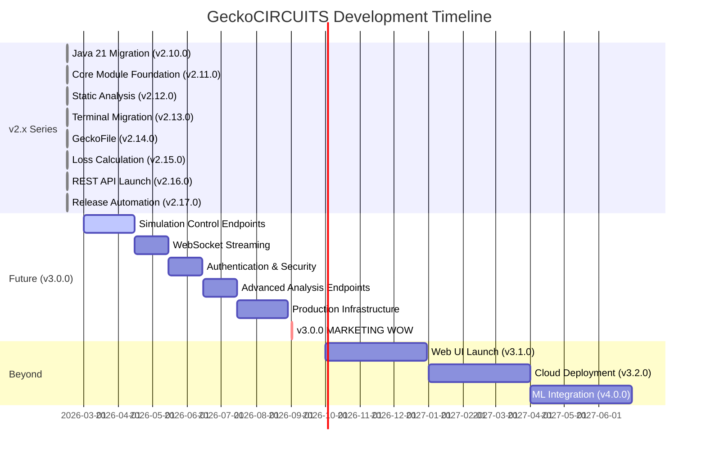

# GeckoCIRCUITS Roadmap

Strategic roadmap for GeckoCIRCUITS development, showing completed milestones and future plans.

---

## Current Status (February 2026)

- **Latest Release:** v2.17.0 - Release Automation
- **Ground Zero:** v2.10.0 - Java 21 Migration
- **Completed Milestones:** 8 releases (v2.10.0 → v2.17.0)

---

## Timeline Visualization

---

## Completed Milestones (v2.10.0 → v2.17.0)

### [v2.10.0](releases/2100.md) - Java 21 Migration (GROUND ZERO)

**Released:** 2025-08-24

### [v2.11.0](releases/2110.md) - Core Module Foundation

**Released:** 2026-02-12

### [v2.12.0](releases/2120.md) - Static Analysis and Code Quality Sprint

**Released:** 2026-02-12

### [v2.13.0](releases/2130.md) - Terminal and Component Package Migration

**Released:** 2026-02-13

### [v2.14.0](releases/2140.md) - GeckoFile Migration (Sprint 4a)

**Released:** 2026-02-14

### [v2.15.0](releases/2150.md) - Loss Calculation Migration (Sprint 4b)

**Released:** 2026-02-14

### [v2.16.0](releases/2160.md) - REST API Launch (Sprint 5)

**Released:** 2026-02-14

### [v2.17.0](releases/2170.md) - Release Automation and Desktop Packaging

**Released:** 2026-02-15

---

## Future Releases

### v3.0.0 - Complete REST API Platform 🚀 (Q3 2026)

**Target Date:** August-September 2026

**Significance:** MARKETING WOW - First production-ready REST API with breaking changes

#### Major Features

**1. Complete REST API Endpoints (30+ total)**

- Simulation control (create, start, pause, stop, results)
- Real-time data streaming (WebSocket support)
- Advanced analysis (FFT, THD, RMS, power quality, Bode plots)
- Batch operations (parameter sweeps, optimization)
- Circuit management (CRUD operations with pagination)

**2. Security & Authentication**

- JWT-based authentication
- API key management
- Rate limiting (100 req/min per user, configurable)
- Role-based access control (RBAC)
- OAuth2 integration (Google, GitHub, Microsoft)
- Audit logging

**3. Production Infrastructure**

- Horizontal scaling support
- Redis caching layer
- PostgreSQL database for metadata
- Prometheus metrics export
- ELK stack logging integration
- Health check endpoints
- Graceful shutdown

**4. Documentation & Developer Experience**

- Interactive API documentation (Swagger UI)
- Postman collection with examples
- Client SDK generation (Java, Python, JavaScript)
- Migration guide from v2.x API
- Video demonstrations

#### Timeline (6-7 months)

- Sprint 6: Simulation control endpoints (6 weeks)
- Sprint 7: WebSocket streaming (4 weeks)
- Sprint 8: Authentication & security (4 weeks)
- Sprint 9: Advanced analysis endpoints (4 weeks)
- Sprint 10: Production infrastructure (6 weeks)
- Sprint 11: Documentation & testing (3 weeks)

---

### v3.1.0 - Web UI Launch (Q4 2026)

**Significance:** Browser-based circuit editor and simulator

- React 18 + TypeScript web application
- Circuit editor with drag-and-drop components
- Real-time oscilloscope visualization (D3.js)
- Parameter editing and tuning
- Circuit library browser
- Tutorial integration
- Responsive design (desktop, tablet)
- PWA support for offline use

---

### v3.2.0 - Cloud Deployment (Q1 2027)

**Significance:** Multi-tenant SaaS platform

- AWS/Azure/GCP deployment scripts
- Kubernetes orchestration (Helm charts)
- Auto-scaling based on load
- Multi-tenant isolation
- User workspace management
- Circuit sharing and collaboration
- Marketplace for circuit libraries
- Usage analytics and billing integration

---

### v4.0.0 - Machine Learning Integration (Q2 2027)

**Significance:** AI-assisted circuit design and optimization

- Circuit optimization using reinforcement learning
- Automated component selection based on specifications
- Anomaly detection in simulation results
- Predictive maintenance modeling
- Training data generation from simulation runs
- Pre-trained models for common topologies
- Neural network surrogate models for fast approximations

---

## Release Frequency

Predictable release cadence:

- **Major releases (X.0.0):** Annually - Breaking changes, major features, marketing events
- **Minor releases (X.Y.0):** Quarterly - New features, enhancements, backward-compatible
- **Patch releases (X.Y.Z):** As needed - Bug fixes, security updates, hotfixes

---

## Long-Term Vision (2027-2028)

### Educational Platform Expansion

- Interactive tutorials with embedded simulator
- Certification programs (Power Electronics Fundamentals)
- Virtual laboratory for universities
- Competition platform for students (circuit design challenges)
- Integration with LMS (Moodle, Canvas, Blackboard)
- SCORM-compliant content packages

### Industry Partnerships

- Semiconductor vendor integrations (Infineon, Wolfspeed, ON Semi, STMicro)
- Component library partnerships
- Enterprise licensing model (per-seat, per-server, site license)
- Professional support tiers (email, phone, dedicated engineer)
- Training and consulting services

### Research Collaboration

- Academic paper citation tracking
- Research dataset sharing (simulation results, validation data)
- Reproducible research workflows (Docker + circuit files)
- Integration with research tools (Jupyter, MATLAB Online, Mathematica)
- Grant-funded development partnerships

---

## Contributing

Want to contribute to the roadmap? We welcome:

- Feature requests and suggestions
- Bug reports and fixes
- Documentation improvements
- Example circuits and tutorials
- Code contributions

See our [Contributing Guide](https://github.com/tinix84/GeckoCIRCUITS/blob/main/CONTRIBUTING.md) for details.

---

## Feedback

Your feedback shapes the roadmap! Share your thoughts:

- [GitHub Discussions](https://github.com/tinix84/GeckoCIRCUITS/discussions)
- [Feature Requests](https://github.com/tinix84/GeckoCIRCUITS/issues/new?template=feature_request.md)
- [Email](mailto:maintainer@geckocircuits.org) (if public)
