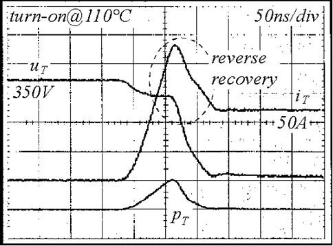
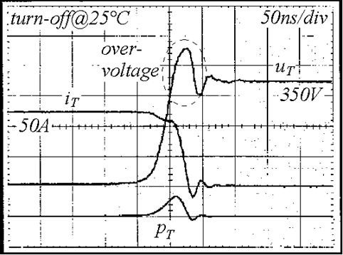
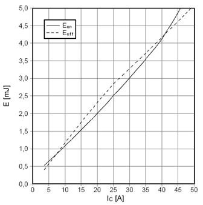
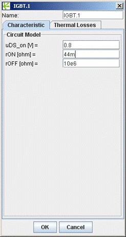
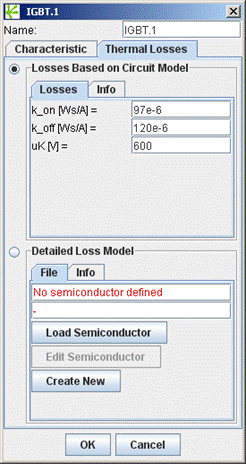
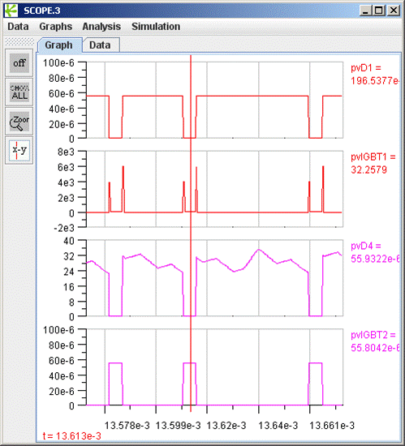
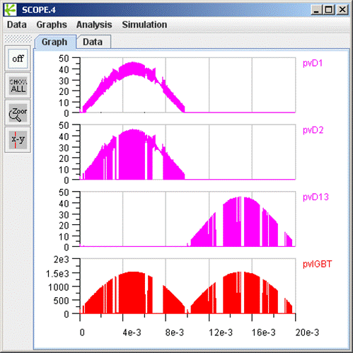
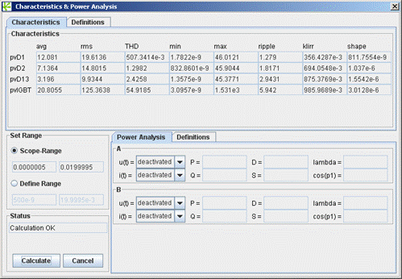

# How to Design a 10kW Three-Step

## PART II: Semiconductor Loss Calculation Demystified

Dr. Uwe Drofenik Gecko-Research GmbH
ETH Zentrum, ETL H13 CH-8092 Zurich, Switzerland
Email    contact@gecko-research.com

May 22, 2009

Semiconductor losses are composed of conduction losses plus switching losses. Both are temperature-dependent. For simplification, here our first assumption is that during operation the junction temperature of all semiconductors is constant (e.g. 125°C).
 
If our thermal design can guarantee this maximum temperature, this is a safe assumption. The junction temperatures might actually be lower during operation which means lower temperature-dependent losses which means lower temperature as originally assumed.
 
In Part III of the report we will compare this simplified approach with a simulation taking the temperature dependence of the losses into account.
 
## Conduction and Switching Losses: Measurement & Simulation

 
*Fig. 1: IGBT Turn-On at High Junction Temperature.*

Figure 1 shows measured IGBT turn-on at high junction temperature. IGBT voltage uCE (uT) needs some nanoseconds to fall from blocking state (350V) to zero. In this time the collector current (iT) rises from zero to full conduction state (here: 50A). Voltage multiplied with current gives loss pT. Therefore, you get a loss peak during each switching action. The energy content of pT during switching is typically given in the data sheet of the power semiconductor (EON and EOFF).
 
Turn-on at high temperature represents a worst case concerning losses. The reverse recovery current from the diode causes loss in the transistor. Therefore, switching losses are always characteristic for a combination transistor – diode.
 
Generally, the switching losses are dependent on
 
- Combination transistor – diode
- Junction temperature
- Gate driver of the transistor
- Parasitic wiring inductance (PCB layout)
- Current and blocking voltage
 

 
*Fig. 2: IGBT Turn-Off at Low Junction Temperature.*
 
Figure 2 shows the turn-off measurement at low temperature for the same IGBT (a typical temporary operating state after turning on a device). At room-temperature (25°C) switching losses are comparably small but it’s an important worst case concerning overvoltage peaks. We want to mention it here, although it has no direct impact on the thermal design.
 
Conduction loss is simply on-voltage multiplied by the current, and integrated over the conduction period. In the following we will show how to model this efficiently.
 
First, Let’s Find the Final Parameters of the Two Topologies
 
Before we select semiconductors and calculate the losses, we have to find our final circuit parameters. In Part I, the average frequency of both converters, the Bidirectional 3-Phase AC/DC PWM Converter with Impressed Output Voltage (‘VSR’ in the following) and the Vienna Rectifier, was well below 15kHz. This might cause acoustic noise problems.
 
Therefore, we need to find parameters that give higher switching frequencies. After some trial and error employing GeckoCIRCUITS (get a free trial version at www.gecko-research.com) we chose
 
$$ VSR: L = 0.35mH; h = 1.0 \rightarrow f_{P,VSR,avg} = 23kHz$$
$$ Vienna Rectifier: L = 0.35mH; h = 1.0 \rightarrow f_{P,VR,avg} = 37kHz$$
 
## How to Select Semiconductors from a Datasheet?
 
First, we select the power semiconductors for the VSR. We need a blocking voltage of at least 700V (the converter DC-side voltage), but it is essential to provide some safety margin (remember the 30% overvoltage in figure 2!). Blocking voltage capability of at least 1000V would be fine. But keep in mind: The higher the blocking voltage, the higher the losses.
 
In the datasheet a typical current is often given as DC at a certain temperature, sometimes even room temperature. It means that the chip can handle the current if you guarantee that your cooling system keeps the junction temperature at this value. This is often unrealistic, so we have to be very careful here.
 
Every semiconductor manufacturer provides products and data sheets a little bit different. For demonstration we will select our semiconductors for the VSR from www.infineon.com. Follow the link “Power Modules” from “Product Categories” at their homepage. Then select “IGBT Modules”. At the product page select “IGBT Modules up to 1200V SixPACK” from the drop-down list “Get Technical Specifications” to get a list of semiconductors. Here, you can make a preliminary selection quickly.
 
To start with, we chose the six-pack power module FS25R12YT3 with 1200V blocking voltage and 25A continuous current at 80°C junction temperature. If we are not satisfied with the losses in the following, we will have to select an alternative component.

*Fig. 3: Output Characteristic IGBT-Inverter.*
 
## What Data Do We Need for a Simplified Analysis?
 
The datasheet provides a lot of data. What do we need right now for our simplified analysis?
 
The graph “Output characteristic IGBT-inverter (typical) at VGE=15V” from the datasheet, shown in figure 3, tells us about the conduction loss of one IGBT for two different junction temperatures (25°C and 125°C).
 
We want to operate the power chips at junction temperatures somewhere around 100°C in order to get the most out of the silicon and to avoid reliability problems. In the following we will use the data taken at 125°C junction temperature for loss calculation. This will guarantee some safety margin for our thermal design. This simplifies the problem significantly without reducing accuracy too much. From figure 3 we can estimate the following parameters:
 
$$ U_{f,125C} = 0.8V $$
$$ r_{ON,125C} = \frac{\Delta u}{\Delta i}=\frac{3V-0.8V}{50A-0A}=44m\Omega$$

With the two parameters above, conduction losses at TJ = 125°C can be easily described employing GeckoCIRCUITS. The switching losses are a little bit more difficult to describe.
 
Switching transients like those shown in figures 1 and 2 are strongly dependent on many parameters that may not be easily available for the system design engineer. Also, a simulation of the switching transient would force the simulator to reduce the numerical step width significantly. This would slow down the simulation at each switching action and would be a permanent source of numerical instability. That’s why a circuit simulator like SPICE is generally not well suited for power electronics.
 
Simulation speed and numerical stability are the reasons why GeckoCIRCUITS performs the simulation of an ideal switch within one single numerical time-step.
 
You can test the free online version of GeckoCIRCUITS at www.gecko-research.com/applet-mode/geckocircuits_demo.html where some of the examples shown here are available, or ask trial@gecko-research.com for free trial version plus the examples of this report.
 
 
The switching energy is modelled in form of a single pulse at each switching action which contains exactly the energy as given in the datasheet, although the shape of this pulse is dependent on the numerical step width and might incorrect in reality.
 
This approach is very fast, extremely accurate and numerically stable. Because such a switching loss calculation is done “in parallel” to the circuit simulation, the lost energy is not lost within the power circuit. Therefore, the system input currents might be higher in reality than in the simulation, because additional input energy is needed for the switching losses. Higher input current might impact the converter behaviour. This is especially a problem if switching losses are high and/or dominating.
 
Therefore, it is important to basically understand how GeckoCIRCUITS (and other circuit simulators) calculate switching losses.
 

*Fig. 4: IGBT Switching Losses Dependent on Current.*
 
The switching losses are shown in figure 4 as loss energy in dependency of current. The curve in the datasheet of the FS25R12YT3 is labelled “switching losses IGBT-inverter (typical)”. Voltage at measurement was 600V and junction temperature was 125°C.
 

*Fig. 5: Output Characteristic Module’s Diodes.*
 
The switching loss description can be simplified by a characteristic slope:

$$ k_{ON,125C@600V} = \frac{E_{ON}}{I_C}=\frac{3.5mJ-0.6mJ}{35A-5A}=97\mu Ws/A$$

$$ k_{OFF,125C@600V} = \frac{E_{OFF}}{I_C}=\frac{2.9mJ-0.5mJ}{25A-5A}=120\mu Ws/A$$

These two values plus the blocking voltage at measurement, VCE = 600V, complete the data we need for loss calculation of the IGBTs.
 
Finally, the losses of FS25R12YT3 ‘s internal diodes are described by the characteristic shown in figure 5. Switching losses of the diodes are neglected here.

$$ U_{f,125C} = 0.8V $$
$$ r_{ON,125C} = \frac{\Delta u}{\Delta i}=\frac{1.5V-1V}{20A-5A}=33m\Omega$$
 
Set Up the Simulation of the Semiconductor Losses
 
The next step is to characterize the power switches in the simulator according to the datasheet values. Double-click the IGBT-symbols in the power circuit of GeckoCIRCUITS. Set the parameters for loss calculation with the values derived from the datasheet as shown in figure 6.
 
Do the same for the power diodes. Note that we omit the switching losses for the diodes.
 
 

*Fig. 6: Setting Conduction and Switching Losses of the IGBT.*
 
You see in figure 6 that it would have been possible to build a more detailed semiconductor loss model which would also be temperature dependent. Here we employ a simple model where all junction temperatures are assumed to be 125°C which give a safety margin in the thermal design.
 

*Fig. 7: Transient Semiconductor Losses Detected in GeckoCIRCUITS.*
 
Figure 7 shows how the loss blocks (“Loss”, red) of GeckoCIRCUITS are employed. After setting the IGBT characteristics (figure 6), double-click the loss-block to select a semiconductor. Figure 7 also displays an open dialog of Loss-block Pv.7, where IGBT.2 is being selected from a drop-down list of all available power semiconductors.
 
Employ the Flow-block from the green Measure-tab to access the transient power flow of each Loss-block. The output of the green Flow-blocks can now be visualized and analysed in a SCOPE.
 
If you run the simulation, you will get a result like the one shown in figure 8 for the transient losses of the two IGBTs and the two diodes in the first bridge leg.
 

*Fig. 8: Transient Semiconductor Losses, VSR.*
 
The diodes display only conduction losses, the IGBTs also show switching losses in form of Dirac-pulses where the pulse-height is defined by the numerical step-width. Only the energy-content of the pulse has meaning.
 
In figure 9, we zoom into the time-behaviour of the transient loss of figure 8 (thermal power in [W]). We can clearly distinguish between conduction loss, turn-on and turn-off loss.
 

*Fig. 9: Zoom: Transient Semiconductor Losses, VSR.*
 
Now we can calculate the average losses.
 
Simply open the SCOPE’s Analysis >> Characteristic menu as shown in figure 10, and press the ‘Calculate’-button to get the average values of the transient losses.
 
The average (conduction) loss of each diode is about 8W, and the average (conduction plus switching) loss of each transistor is approximately 54W.
 

*Fig. 10: Average Semiconductor Losses, VSR.*
 
So the total semiconductor loss of the VSR is 372W. The converter efficiency is 96.4% if we neglect all other losses.
 
## Can We Get Higher Efficiency with the Vienna Rectifier?
 
The much lower average switching frequency indicates so (see end of Part I). But if there is an improvement, is it significant? GeckoCIRCUITS makes it easy to find out.
 
This time we look into the online-tables of www.ixys.com to find power semiconductors. The Vienna Rectifier’s neutral point at the DC side splits the blocking voltage into half so that each semiconductor only has to deal with 350V. Generally, we want to select an IGBT with minimum 500V blocking voltage and current in the range of 25-35A. Go “Product Portfolio” > “Power Devices” and study the components available.
 
The device IXGP 30N60B2 can handle 600V and advertises a current capability of 70A if you can make sure that the junction temperature is never higher than 70°C (30A in case of 110°C).
 
From the datasheet of this IGBT we extract from the “Output characteristics @ 125 Deg. Celsius” the following parameter for GeckoCIRCUITS:

$$ U_{f,125C} = 0.9V $$
$$ r_{ON,125C} = \frac{\Delta u}{\Delta i}=\frac{2.25V-0.9V}{50A-0A}=27m\Omega$$

*Fig. 11: Transient Semiconductor Losses, Vienna Rectifier.*
 
The table at the second page of the datasheet gives the switching losses for junction temperature 125°C, voltage 400V and inductive load with

$$ E_{ON,125C@400V,24A} = 0.22mJ \rightarrow$$

$$ k_{ON,125C@400V} = \frac{E_{ON}}{I_C}=\frac{0.22mJ}{24A}=9\mu Ws/A$$

$$ E_{OFF,125C@400V,24A} = 0.9mJ \rightarrow$$

$$ k_{OFF,125C@400V} = \frac{E_{OFF}}{I_C}=\frac{0.9mJ}{24A}=37.5\mu Ws/A$$

For all diodes of the Vienna Rectifier we chose the device DHG30I600HA from IXYS (single diode in TO 247, 600V/30A). For the conduction loss calculation we get directly from the table at the first page of the datasheet threshold voltage and slope resistance at 150°C as

$$ U_{f,125C} = 1.31V $$
$$ r_{ON,125C} = \frac{\Delta u}{\Delta i}=28.6m\Omega$$

 
Figure 11 shows how to integrate loss measurement into the Vienna Rectifier model. When we parameterize the power diodes and IGBTs of the Vienna Rectifier with these values, we can simulate transient losses as shown in figure 12.
 

*Fig. 12: Transient Semiconductor Losses, Vienna Rectifier.*
 
From the Analysis >> Characteristic menu in SCOPE we can directly calculate the average losses.
 

*Fig. 13: Average Semiconductor Losses, Vienna Rectifier.*
 
In figure 13 you see that the average IGBT (conduction plus switching) loss is approximately 21W, while the loss of the three different diodes of the upper bridge leg is 12W, 7W and 3W.
Total semiconductor losses of the Vienna Rectifier in this report are 197W resulting in a converter efficiency of 98.1% if we neglect all non-semiconductor losses.
So while the average switching frequency of the VSR is approximately 60% higher than for the Vienna Rectifier, the semiconductor losses are even 90% higher. This is because semiconductors with lower blocking ability can be employed in the Vienna Rectifier.
 
## So How Fair Was this Comparison?
 
Obviously, the choice of the semiconductors has a major impact on resulting losses. If you employ oversized semiconductors the losses will be reduced significantly. This is true for both topologies. Here we tried to find semiconductors for both topologies of comparable voltage- and current-capabilities.
CoolMOS for the Vienna Rectifier to reduce conduction losses and SiC-diodes to reduce switching losses (contact PES/ETH Zurich for more information). Furthermore, you could employ different diodes (mains-side / neutral-point-side / free-wheeling) for optimization.
We saw that different manufacturers provide different datasheet information of their power semiconductors. Even datasheet information for different semiconductors of the same manufacturer might be inconsistent.
It is a main task of the system engineer to extract the semiconductor data he needs from the data sheet. As we have seen, it comes down to a very small number of values to characterize switching- and conduction losses in GeckoCIRCUITS with high accuracy.
 
## What’s next?
The open questions in order to finish our converter comparison concentrate on the temperature. You will find in Part III of the report:
 
- How do perform a ‘quick and dirty’ calculation of junction temperatures?
- What about transient junction temperatures? Can you guarantee junction temperatures in case of short-term overload?
- How to select a heat sink? What about thermal grease?
- How can I model a heat sink for the circuit simulation?
- Does it make a difference if temperature-dependency of the losses is considered?
 
## Further Information
 
For more information on the Vienna Rectifier visit
 
http://www.ipes.ethz.ch/ipes/adv_index.html and
http://www.ipes.ethz.ch/ipes/2002Vienna1/vr1overview.html
 
 
Part III of this report will be published on www.gecko-research.com
GeckoCIRCUITS was designed especially to solve such problems quickly and with minimum learning effort.
 
You can test the free online version of GeckoCIRCUITS at www.gecko-research.com/applet-mode/geckocircuits_demo.html where some of the examples shown here are available, or ask trial@gecko-research.com for free trial version plus the examples of this report.
 
Gecko simulation models:
- Vienna Rectifier: vr1_therm.ipes
- VSR: sixsw_therm.ipes
