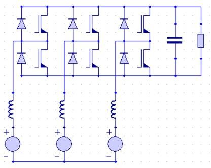
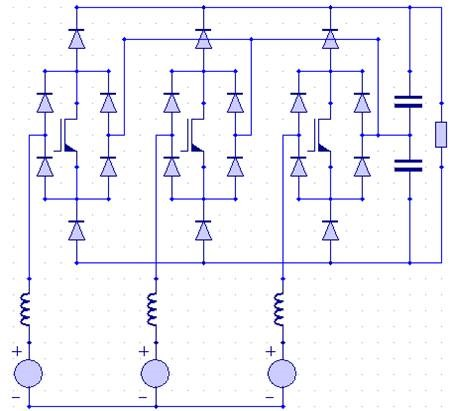
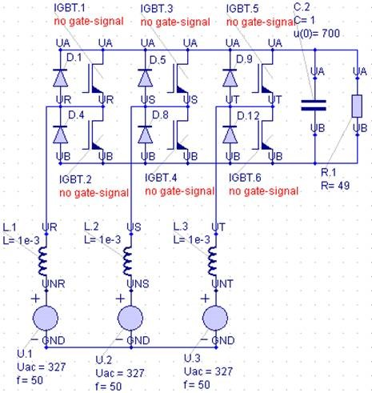
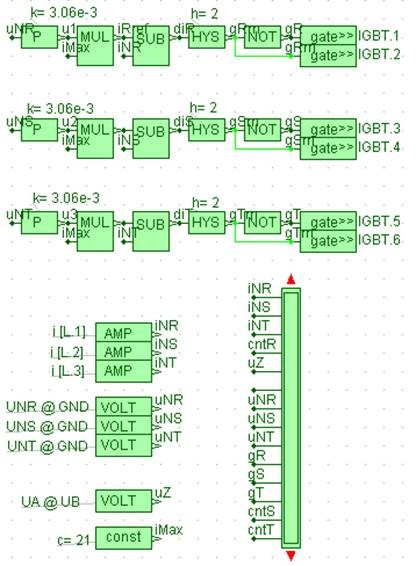

# How to Design a 10kW Three-Phase AC/DC Interface Step by Step
 
## PART I: How Can I Compare Topologies?
 
Dr. Uwe Drofenik Gecko-Research GmbH
ETH Zentrum, ETL H13 CH-8092 Zurich, Switzerland
Email    contact@gecko-research.com
 
May 22, 2009

# How Can I Compare Topologies?
 
A typical high-performance solution for the front-end of three-phase AC-DC conversion looks like this:

 
The features of this Bidirectional 3-Phase AC/DC PWM Converter with Impressed Output Voltage (‘VSR’ in the following) are
 
- Sinusoidal input currents
- Controlled DC-voltage (e.g. voltage changes in the mains)
- Well established technology
 
The Vienna Rectifier is shown in figure 2.
 
It can also provide sinusoidal input currents and controlled DC-voltage. The control is of comparable effort, and the DC-side neutral point can be stabilized easily (this had been a main concern of engineers).
 
- Semiconductor blocking voltages reduces by factor 2
- Just three power switches
- Higher efficiency
- You cannot short-circuit the DC by control-failure
- No energy-feedback into the mains possible
 

 
So if you don’t feed energy back into the mains the Vienna Rectifier seems to be the better solution as a high quality front-end (e.g. telecom power supply).
 
# What is a Fair Base of Comparison for Converter Systems?
 
Besides cost and reliability, converter volume is relevant in many applications. If we accept a certain amount of harmonics of the mains currents, we have the choice between
 
- Large input side inductor, therefore low switching frequency and low switching losses, therefore small heat sink
 
- Small input side inductor, therefore high switching frequency to keep the current ripple below the allowed maximum, therefore high switching losses and need for a large heat sink
 
So it is an optimization problem between input inductor volume and heat sink volume. Allowing higher input current harmonics means you need a large-volume EMI filter at the input-side. The EMI-filter is another bulky component of the system to be considered.
 
Let’s perform a preliminary topology comparison based on the assumption of equal input current ripple amplitudes (first simplification, resulting in equal EMI filters). We assume hysteresis current control and constant output voltage. That is achieved by setting the DC capacitors to extremely high values and setting initial voltage values according to the output voltage. For this simple model we don’t need the voltage control loop, which is therefore omitted.
 
# What Simulator to Use for Such a Comparison?
 
Let’s build the VSR in a few steps employing the simulator GeckoCIRCUITS.
 
1. Building the power circuit. If the blue Circuit-tab with the circuit components is active, you can activate the blue pen for drawing connection lines by a right-click of the mouse. Note: The node-labels can be used to connect without drawing lines. This might help to keep a better overview.
 

 
You have not yet provided gate signals, therefore a warning is shown in red. We provide the missing gate signals in the next step.
 
2. Next, build the control circuit. You could do the control in an external simulator, e.g. Simulink, coupled with GeckoCIRCUITS, but we will build it directly in GeckoCIRCUITS. When a green tab is active, you can activate the green pen for connection-drawing.
 
Source/Sink-tab (green): Employ GateControl-blocks to provide control signals for power switches.
 
Measure-tab (green): Employ Voltage-blocks to measure voltage between nodes. Don’t forget to define node names in the power circuit first. Employ Current-blocks for current measurement. 
 

 
The current control is simplified here. A given reference current amplitude is used to define the transient reference current of each phase. Comparing with the measured phase current, a hysteresis controller defines the switching signals. For the sake of simplicity, we neglect a gate signal logic, which would normally be included to avoid overlapping on-times of the upper and lower switches of each leg.
 
Please note: This kind of current-control scheme is only shown for demonstration of our simulation and design strategy. In real converter systems one would prefer PWM control based on defined carrier-signals and/or DSP control.
 
3. Employing the SCOPE (from the green Source/Sink-tab) for monitoring current, voltage and signals. The signal names displayed in the graphs will be equal to the SCOPE-node names you chose.
 
In the menu Graphs >> Signal-Graph you can open a connection matrix to change the number of graphs (“Add Graph”). By right-clicking with the mouse you can define which signal to display in which graph. Left-clicking a red “Y” in the matrix opens a curve editor (setting style and color of individual curves).
 
If you activate the “Digital”-checkbox to the right of the matrix, signal will be displayed in the digital-mode. Crossing the value “0.5” defines if a signal will be displayed as “1” or as “0”. 
 

 
Perform a first test run with parameters that make some sense to verify your simulation model. Let’s assume a requirement of 10kW at the DC-side and 400V mains three-phase. 400V three-phase means that the mains phase voltages have amplitudes of 327V. For the mains current amplitude we estimate

$$
3/2*u_N*i_N*\eta_{SYS} = P_{DC} \Rightarrow 
i_N=\frac{P_{DC}}{(3/2*u_N*eta_{SYS}/2*u_N*i_N*\eta_{SYS} )}
$$

 
VSR and Vienna Rectifier are both boost-type which means that DC output voltage must exceed input voltage by a certain amount. We define a DC voltage of 700V in the following. We start with an assumption of an input inductor L=1mH, and a maximum acceptable mains current ripple amplitude of ±20%, (which gives hysteresis h=2A) of the mains current amplitude.
 
Set the constant time-step of the numerical simulation (here: 500ns) in the menu Simulation >> Parameter and start the simulation via menu Simulation >> Init&Start. Your result should look like figure 7.
 

 
A rule of the thumb is to set the time step by a factor 100 smaller than the smallest system time-constant to get the maximum acceptable value. The smallest system time-constant is often defined by the PWM switching frequency (in case of hysteresis current control we don’t know). You might reduce the time-step in a second simulation run to find out if this changes the results. If so, you might reduce further. 
 
## Is It Difficult to Model and Simulate a Vienna Rectifier?
No. The effort is comparable to the VSR.
 
There are less active power switches. You have to take the sign of the phase voltage into account when making a switching decision, but that can by done by a simple XOR. Here we do not model the additional control loop to guarantee stability of the neutral point because this has currently no impact on our topology comparison.
 

 
In figure 8 we didn’t draw the connection lines from the three bridge leg centre points to the DC-side neutral point NP (compare to figure 2). Instead we realised these essential connections by setting four labels “NP” at the according nodes which improves the clearness of the picture.
 

 
The two output capacitors show extremely high capacitance. By setting initial voltages (350V each) they behave like voltage sources. Therefore, the model can be simplified by
 
- Omitting the DC voltage control loop
- Omitting the control loop for stabilization of the neutral point potential at NP (symmetric output voltage distribution)
 
The current control of the Vienna Rectifier can easily be realised via hysteresis control (please note: this is only for demonstration, not for realization of hardware prototypes and/or products). Compared to the control of figure 4, the Vienna Rectifier needs a switching signal inversion if the input voltage of the according phase is negative. This is done by an XOR-block.
 

 
With the same parameters values as for the VSR, we simulate all important voltages, currents and signals. Again, we set the numerical time-step to 500ns and simulate one mains period (20ms for 50Hz mains).
 
## OK, Both Topologies Work – How to Proceed?
 
In case of hysteresis control there is no clearly defined switching frequency. Even if we count the switching actions and define an average value to calculate an average switching frequency, we do not know about the switching losses because the switching losses are proportional to the current which is being switched. That’s why some current controllers increase switching frequency around zero-crossings of the current to improve current shape without increasing losses.
 
Let’s use the Counter-block from the Digital-tab (green) to get an idea of the average switching frequency. But don’t forget that we have to weight each switching action with the current being switched to get real switching losses.
 

 
Input z of the counter would reset the output of the block to zero. No signal z is defined in our model. Therefore, GeckoCIRCUITS sets input z to zero. We don’t reset the counter in this simulation.
 

 
From R and T in figure 12 we estimate the average switching frequency of the Vienna Rectifier to be:

$$ f_{P,VR,avg} \simeq 168/20ms=8.4 kHz$$
 
For longer simulations this average frequency approaches 8kHz. Our first estimate was quite good.
 
If we perform the same with the VSR, the switching frequency is

$$ f_{P,SIXSW,avg} \simeq 12.5 kHz$$
 
We see two important things immediately:
 
1. The average switching frequency of the VSR is 50% higher than the one of the Vienna Rectifier. This results in the Vienna Rectifier being more efficient, and requiring a smaller heat sink.
 
2. Both average frequencies are well below 15kHz. There will be noise emission which is not acceptable in many applications. It is a good idea to redesign both topologies. This can be done very quickly now with both simulations running in GeckoCIRCUITS.
 
As mentioned at the beginning, a good comparison is, for example, based on heat sink volume vs. input inductor volume, not on average switching frequencies.
 
That’s why we have to calculate the losses, especially switching plus conduction losses of the power semiconductors. Those losses are strongly dependent on the selected power semiconductors. The losses are also temperature-dependent. Most relations are non-linear.
 
- How significant is the obvious advantage of the Vienna Rectifier?
 
- How do we get semiconductor parameters into our simulation?
 
- Can we minimize losses if we consider that the Vienna Rectifier shows only half of the blocking voltage as compared to the VSR?
 
- What about the temperature-dependency of losses?
 
- How can we estimate the heat sink size if we know the total losses?
 
- What about system efficiency?
 
We answer all questions and more in Part II of this report. It sounds like a lot of thermal engineering knowledge is needed, but we show how an electrical engineer can do it with minimum effort in very short time by employing GeckoCIRCUITS.
 
GeckoCIRCUITS was designed especially to solve such problems quickly and with minimum learning effort. You can test the free online version of GeckoCIRCUITS at www.gecko-research.com/applet-mode/geckocircuits_demo.html where some of the examples shown here are available, or ask trial@gecko-research.com for free trial version plus the examples of this report.

## Further Information
 
For more information on the Vienna Rectifier visit
 
http://www.ipes.ethz.ch/ipes/adv_index.html and
http://www.ipes.ethz.ch/ipes/2002Vienna1/vr1overview.html

Gecko models: 
- Vienna Rectifier: vr1_therm.ipes
- VSR: sixsw_therm.ipes
 
 
